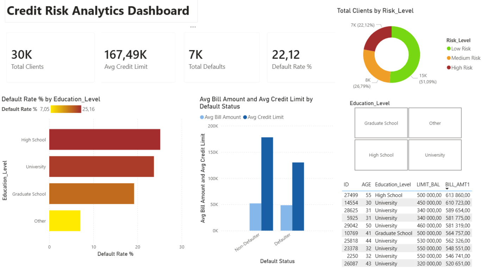

# Credit Risk Analytics Dashboard

SQL analysis and Power BI dashboard for credit risk segmentation on UCI Credit Card Default dataset (30,000 records).

## Project Overview

This project analyzes credit card client data to identify default risk patterns across customer segments. It combines SQL data analysis with an interactive Power BI dashboard to surface actionable insights for credit risk management.

## Tech Stack

- **MySQL** — data storage and SQL analysis
- **Power BI Desktop** — dashboard and visualizations
- **DAX** — calculated columns and measures

## Dataset

UCI Credit Card Default dataset:
- 30,000 client records
- Features: demographics (age, education, marriage), credit limit, payment history, bill amounts, default status

## Analysis Questions

1. **Default rate by education level** — which segments have highest default risk
2. **Defaulter vs Non-defaulter comparison** — average credit limit, bill amount, payments
3. **Risk segmentation** — Low/Medium/High risk distribution
4. **Top 10 highest-risk defaulters** — clients with highest bill amounts who defaulted

## Key Insights

- High School clients have ~25% default rate (highest)
- Other category has ~7% default rate (lowest)
- 51% of clients are Low Risk, 27% Medium, 22% High Risk
- Defaulters have lower average credit limit and bill amounts than non-defaulters

## Files

- `credit_risk_analysis.sql` — SQL queries for all 4 analysis questions
- `Credit_Risk_Dashboard.pbix` — Power BI dashboard file
- `dashboard_screenshot.png` — preview of the dashboard

## Dashboard Preview

## Author

Georgi Terziev — [LinkedIn](https://www.linkedin.com/in/georgi-terziev-7980b4403/)
